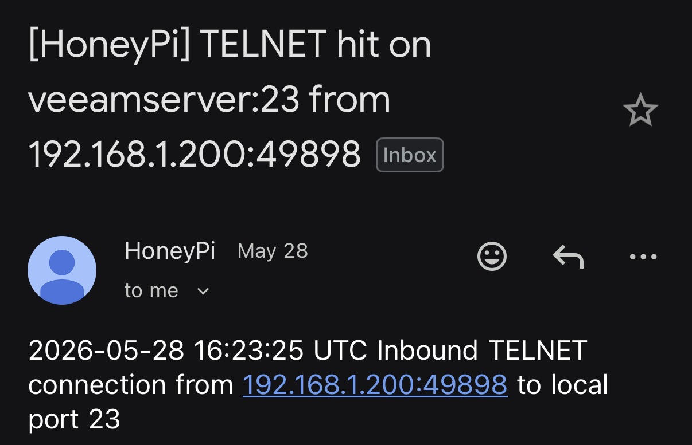

# HoneyPi

HoneyPi is a lightweight Raspberry Pi honeypot designed to provide an affordable and simple indicator of compromise for home labs, small businesses, and internal networks.

Modern attackers often move laterally through networks quietly and opportunistically. Most environments do not have the budget or infrastructure for full packet capture, enterprise IDS appliances, or dedicated security monitoring teams.

HoneyPi aims to bridge that gap.

Deploy a low-cost Raspberry Pi device on your network that masquerades as a vulnerable or interesting target and receive alerts when suspicious activity is detected.

---

# Why HoneyPi?

HoneyPi is intentionally simple.

Instead of attempting to emulate entire operating systems or complex enterprise services, HoneyPi focuses on high-confidence indicators that frequently appear during reconnaissance and lateral movement activities.

HoneyPi currently detects and alerts on:

* Port scanning activity
* SSH connection attempts
* FTP connection attempts
* Telnet connection attempts
* VNC connection attempts

These events often indicate:

* Internal reconnaissance
* Malware propagation
* Unauthorized scanning
* Lateral movement attempts
* Misconfigured security tools
* Potential compromise

---

# Key Features

* Lightweight deployment on Raspberry Pi
* Minimal maintenance requirements
* Email alerting support
* Custom script execution support for active response actions or custom alerting
* IP allowlisting / whitelisting support
* Custom hostname support to entice attackers
* Simple installation and configuration
* Designed for home labs and small business environments

---

# Architecture

HoneyPi listens for inbound connections on common management and legacy service ports commonly targeted during attacker reconnaissance:

| Service | Port |
| ------- | ---- |
| FTP     | 21   |
| Telnet  | 23   |
| SSH     | 2222 |
| VNC     | 5900 |

When activity is detected:

1. HoneyPi logs the event in /var/log
2. An email alert can be sent
3. A custom response script can optionally execute in form SCRIPT attacker_ip (example: script.sh 192.168.12.252)

---

# Installation

## Requirements

* Raspberry Pi running Raspberry Pi OS / Debian-based Linux
* Internet connectivity
* Optional- Gmail account with App Password enabled 

Google App Password setup:

https://support.google.com/mail/answer/185833

---

## Install Steps

```bash
git clone https://github.com/venator-ir/HoneyPi.git
cd HoneyPi
chmod +x *.sh
sudo ./honeypi-installer.sh
```

The installer will guide you through:

* Email alert configuration
* Alert destination setup
* Hostname customization
* Optional script execution configuration

---

# Example Alert



---

# Logging

* Alert logs are located in /var/log/honeypi.log
* Watchdog logs for ensuring the honeypot service is always running is located in /var/log/honeypi-watchdog.log

---

# Static IP Configuration (optional)

Example using NetworkManager:

```bash
nmcli connection show

nmcli con mod "netplan-eth0" ipv4.method manual
nmcli con mod "netplan-eth0" ipv4.addresses 192.168.50.10/24
nmcli con mod "netplan-eth0" ipv4.gateway 192.168.50.1
nmcli con mod "netplan-eth0" ipv4.dns "1.1.1.1 8.8.8.8"

nmcli con up "netplan-eth0"
```

---

# Security Notes

* HoneyPi is designed as a lightweight detection mechanism, not a full IDS platform.
* Use strong passwords or SSH keys for administrative access.
* Place HoneyPi on internal networks where unauthorized activity would be suspicious, like in Dark Space subnets or near cyber key terrain used by attackers.
* Monitor alerts regularly.


---

# Disclaimer

HoneyPi is intended for defensive security monitoring and research purposes only. Deploy responsibly and ensure compliance with your organization's policies and applicable laws.

---

# Maintained By

Venator Cyber Operations Group

https://venatorcyber.io
